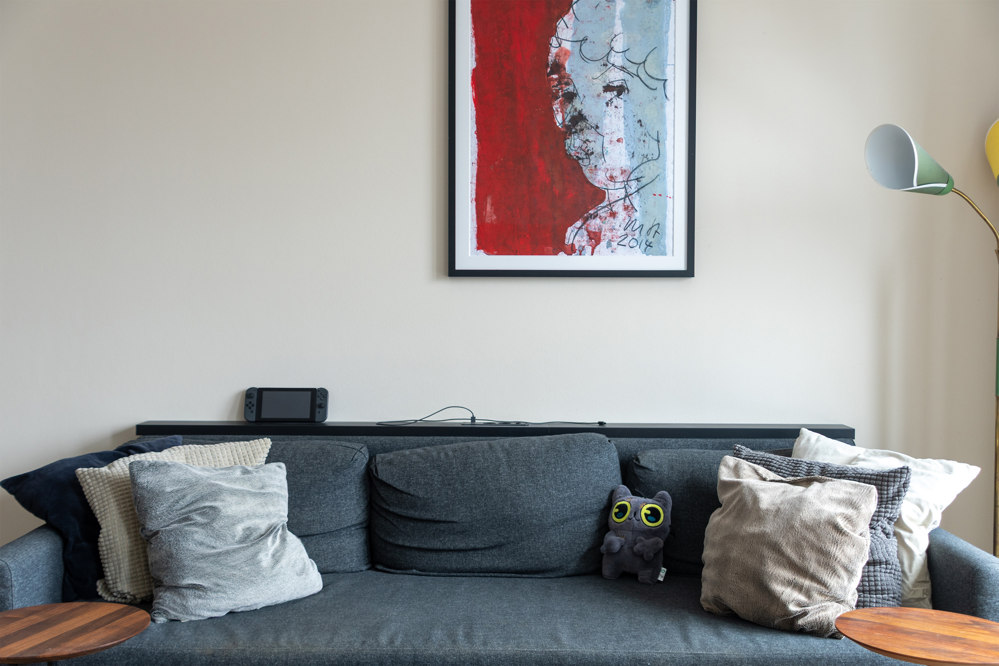

https://github.com/user-attachments/assets/19850540-a837-4b17-acfd-196f55fda31b

Your client found a wonderful stock picture. It's an exact match to the feeling they want want to convey on their super special landing page. The dynamic is _stunning_. It draws the customers right in and leaves them in awe. It'll boost conversion by levels over 9000, maybe even higher. Its the best picture in the history of pictures, maybe ever and the _whole_ content team is ecstatic! 

There's only one catch – it doesn't fit the CD hero section's height on anything above LG. That woman's perfect smile is gone, cut off below and now all you can see are  just two empty eyes. On mobile its even worse: It's just a nose and two front teeth!

The content team is not happy. _You_ have to make that picture _work_, **BUT** without breaking anything. Every single other image **must** stay excatly as is.

You debate with your developer and eventuelly settle for a solution, where the content team can provide an UUID, only for you to manually apply custom CSS rules then. It's just no good.


## Getting started
Better Cover requires <b>React v19.</b>
```bash
npm install better-cover
```
### Import styles
```ts
// css import
@import "~better-cover/styles.css"

// js/ts import
import "better-cover/styles.css"
```

### Import components
```ts
import { Picture, Source } from "better-cover";
```

## How it works

Let me introduce you to my living room couch.

Note: The image you see here is the actual image used in the following videos.



There are some items cluttered around it, one of which happens to be a [plush toy of a youtuber's cat](!https://www.youtube.com/watch?v=Oc91iOxcB3c).  

Well, let's toy with it' shall we?

---

1. **Default image behavior**  
  Assuming the image is set to what-should-be-standard `object-fit: cover` and default `object-position: 50% 50%`, it get centered within it's containing element.  
  But as the size of that container element changes, so does what we can see of the image – and it just so happens that my cute plush toy (that everybody is supposed to see!) is getting cropped.

    https://github.com/user-attachments/assets/094fb3b1-6e78-418c-9aae-a00dd787463e


2. **Better Cover Component**  
  We really, really want that cute plush toy to always be seen in the container!  

    And alas, Better Cover helps us to achieve that! Here you can see, the plush toy stays put at the edge of the container when normally it would  be cropped in that direction:

      https://github.com/user-attachments/assets/a2bd8a77-3e3b-4a0f-b89d-a28dbeb4f448


4. **How does it work?**  
  With Better Cover, you define a 'Focus Zone' within it's correlating image source. This image is then matched against a 'Target Zone' and transformed in a way that the Focus Zone is kept within the Target Zone.  
  Thinking of these Zones as boxes, it looks like this:

      https://github.com/user-attachments/assets/3312bf8e-c8a1-4ca8-9de1-e0c73fd035a3


    

5. **Flexible and Customizable**  
  Better Cover provides a range of options for you to make your images most important part always visible: If you are using different images for varying viewport widths for example, you can create individual [Sources](#source), each with their own `@media` and Focus Zone properties. Additionally, to layout the Target Zone, you can simply pass CSS classes!

    In the previous videos, the Target Zone covered the whole width and height of the container – let's instead go with a Target Zone that covers only the right half of the container. And to spice it up, we don't go after the plush toy this time, but rather the handheld console:
   
    https://github.com/user-attachments/assets/68c1733d-ac9d-485d-8792-b5470eccd20e


## Exports
### Picture
* `children`: Array (required)  
  Array of [Source elements](#source).  
  _At least one Source must be provided._

* `src`: String (required)  
  Fallback image URL if no Source matches.

* `srcSet`: String  
  Fallback image srcSet if no Source matches.

* `className`: String (required)  
  CSS style classes applied to the top level component.  
  _The top level component is the area to be covered._

* `targetZoneClassName`: String (required)  
  CSS style classes applied to the Target Zone.  
  _If no styles are provided, the Target Zone always covers the whole height and width of the top level component._

* `focusZoneClassName`: String  
  CSS style classes applied to the Focus Zone.  
  _If provided, the Focus Zone element is rendered._

* `imageClassName`: String  
  CSS style classes applied to the image element.

* `alt`: String  
  Accessible alternate text for the rendered image. If omitted, the image is exposed as 'decorative' within the accessibility tree.  
  _Can be overwritten by [Source elements](#source) even when omitted._

* `loading`: 'eager' | 'lazy'  
  Loading behaviour of the rendered image.  
  _Defaults to `'lazy'`._

* `refs`: Object  
  Pass React refs to inner elements within the Picture component. See API for details.

* `debug`: Boolean  
  Display overlays highlighting the Safe Zone and Focus Zone.  
  _Defaults to `false`._

### Source

* `srcSet`: String (required)  
  Comma-separated list of one or more image URLs and their **pixel density** descriptors.   
  >⚠️ **Important**  
  > Sources with **width descriptors** will be omitted.
  
  >⚠️ **Important**  
  > An individual Source's images must be of the same aspect ratio.  
  > If you require differently sized images, use separate Source Elements with individual `media` attributes.

* `size`: Object (required)  
  Width and height of the image in pixels.  

* `focusZone`: Object (required)  
  X and Y Position and width and height of the Focus Zone in pixels.  

* `media`: String  
  Specify the Source's [media query](https://developer.mozilla.org/en-US/docs/Web/CSS/Guides/Media_queries).

* `alt`: String  
  Overwrites [Picture's](#picture) default alternative text while the Source is active.  
  _If provided, it exposes the image within the accessibility tree even when it wasn't previously._

### Hooks

Aside from the [Picture](#picture) and [Source](#source) components, Better Cover exports two hooks, that you might find useful for other parts in your project:

### useScreen
Returns the current screen information including size, device pixel ratio, and orientation.

```ts
import { useScreen } from "better-cover";

const screen = useScreen();
// screen: { width, height, dpr, orientation }
```

### useElementRect
Returns the current size and position of a referenced HTML element.

```ts
import { useElementRect } from "better-cover";
import { useRef } from "react";

const ref = useRef<HTMLElement>(null);
const rect = useElementRect(ref);
// rect: { x, y, width, height }
```

## License
MIT
